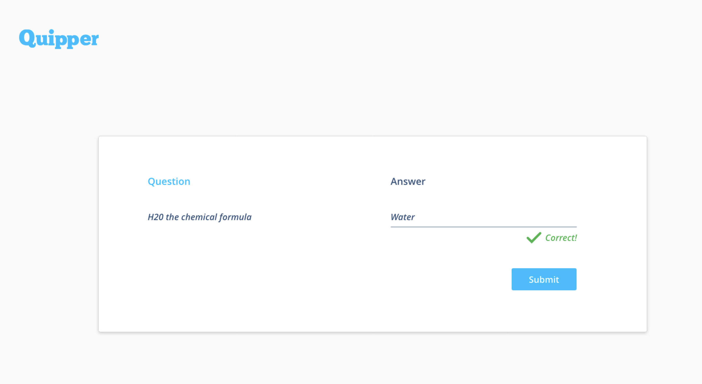

## 1: The new one

Welcome! You must be the new one! You know the _Chief Technology Officer_? Well, he loves creating cool working applications! Actually, we have a bare-bones project that needs some tweaks but all of our devs are busy right now. Would you mind throwing us a hand? Thanks!

### Objectives

*   Implement a way for the user to create, read, update, and delete questions
*   Implement a quiz view for the user to view and answer the questions one at a time and in **random** order
*   Once the user provides an answer and clicks submits, the app should give immediate feedback on whether the answer provided is **correct** or **incorrect**

!>  Once you finish, please remember to `commit && push` to your branch.

### /client

*   Open `client/src/App.jsx` and give it a read. You will find out there what you need to do.
*   Also, you need to style the `Quiz view`. Below is the mockup which indicates how the view should look like.

### /backend

*   Please provide a question catalog and allow to `create, read, update and delete` questions via API.
*   We work using test-driven development so we have already set up the tests for you.

!> Run the test suite using `bundle exec rspec --tag level_one` and do your best to cover all the specs.

[Next challenge](user_stories/level_two.md)
