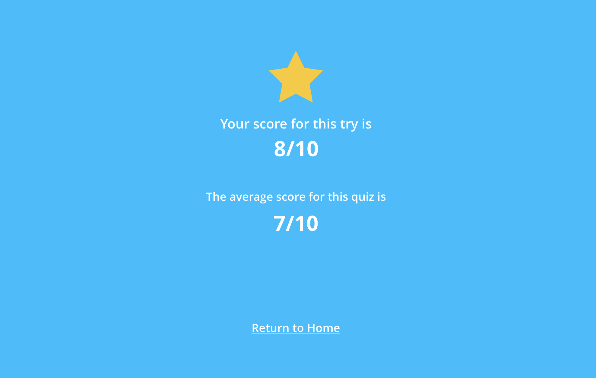

[Go back](user_stories/level_two.md)

## 3: A minimum viable product

Hang in there! Actually, we would like to present this app to the Chief Technology Officer, but perhaps we can add a cool reporting feature.

When a user finishes a Quiz, let’s score it and compare it agains all the other registered attemps.

### Objective

*   Show the results of the quiz after the user answers all the questions in it

!> Once you finish, please remember to `commit && push` to your branch.

### /client

*   After finishing a Quiz, the user needs to be redirected to a results view, showing the score of the current try of the quiz and a comparation of it against all the other attempts made.

### /backend

*   Provide logic for quiz attempt.
*   Once again, we have already set up the tests for you.

!> Run the test suite using `bundle exec rspec --tag level_three` and do your best to cover all the specs.
