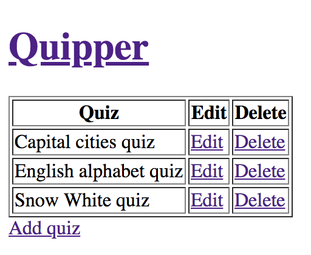
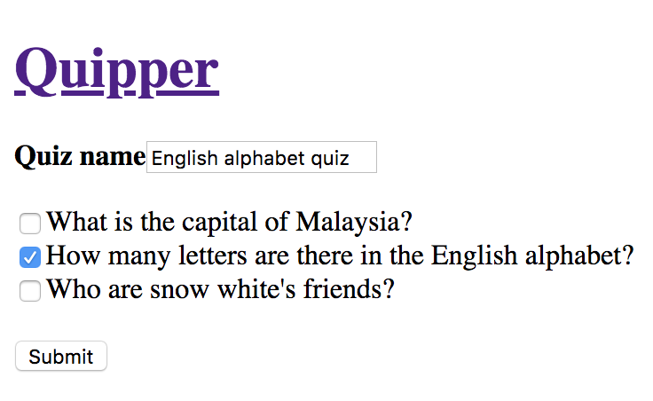
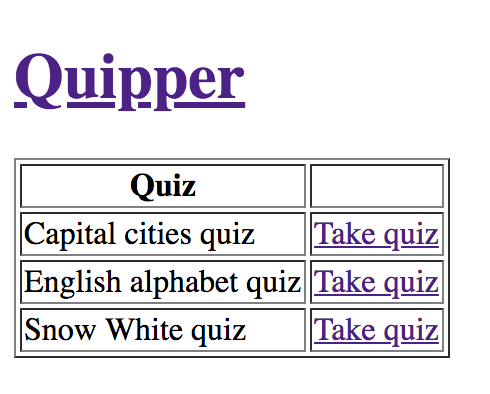

[Go back](user_stories/level_one.md)

## 2: Some changes

Thanks for the help on the previous specs! If you’re still up for it, our product manager just passed by and asked us to add more features to the site. Would you mind taking care of it as well? You rock!

Remember the question catalog you implemented? Well, now we would like to use it as a question bank to create quizzes. For that, we need to give the user the ability to list, `create, read, update, and delete` quizzes. To clarify, a quiz is composed of one or more questions.

Another thing is that we would like to user to be able to select a quiz from a list and answer the questions in it in random order.

I think that’s all! Let us know when it's done! Thanks!

### Objectives

*   Implement a page for the user to create quizzes out of questions
*   Show a list of available quizzes and allow user to select one of those to answer

### /client

*   Provide view for creating, reading, updating, and deleting quizzes  
*   Provide view with list of quizzes 
*   Selecting a quiz will show the questions within it one at a time and in random order 

### /backend

*   Provide quiz endpoints to `create, read, update and delete` via API.
*   Once again, we have already set up the tests for you. Please run the test suite using `bundle exec rspec --tag level_two` and do your best to cover all the specs.

Once you finish, please remember to `commit && push` to your branch.

[Next challenge](user_stories/level_three.md)
